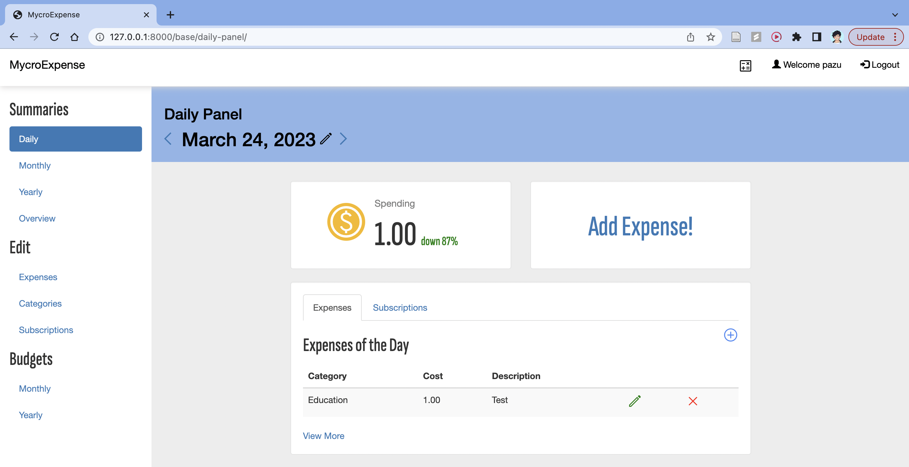
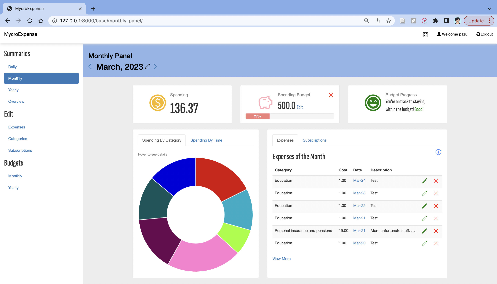
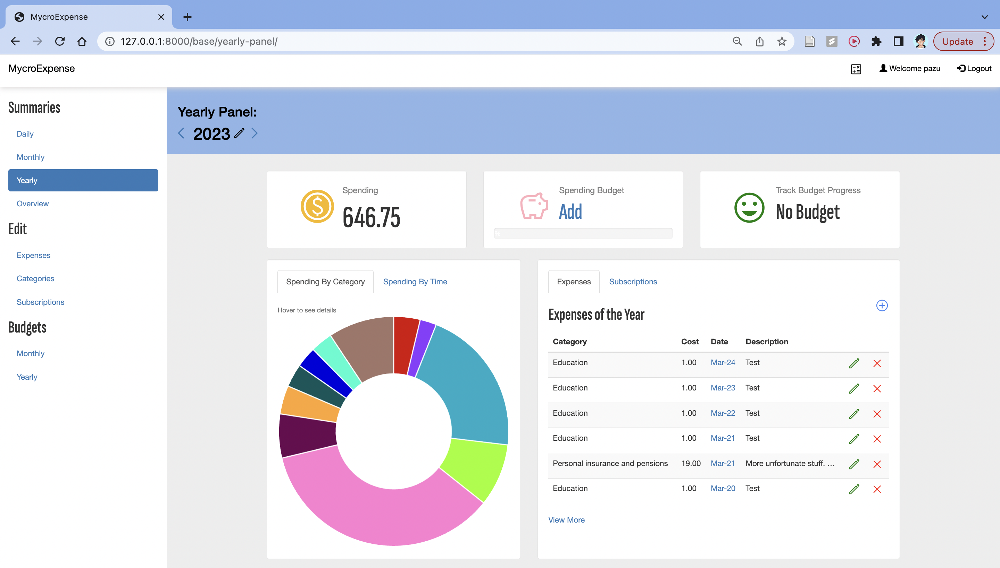
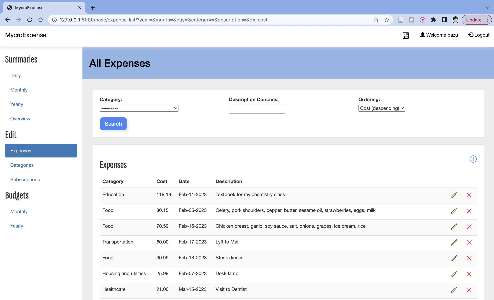

# MycroExpense: A Django Expense Tracker Web Application

## Project Features

### Overview

This is a Django web application allows users to input and track their personal expenses. Users can also track subscriptions that will automatically create expenses according to the subscription billing cycle. Additionally, users can create spending budgets for months and years. Finally, there are summary views that displays aggregate statistics for a user over a given period of time: whether that be for a day, for a month, or for a year.  

Currently, this web application is still in the development stage and it is not deployed, so you cannot access this web application via an online URL. If you want to use this application, you'll have to clone the repo and run it yourself. Instructions will be detailed in the **Project Setup** section. 

### Summary Views

Below is a screenshot of the daily view for a test user *pazu*. This daily view aggregates the summary expenditure for a user on a given day, as dictated by the date displayed in the blue section. In this screenshot, we can see that the user *pazu* has spent 1 dollar total in the day of March 24, 2023. We also have access to a list of expenses incurred on that day and a list of subscriptions (both active and unactive) relevant to that day. 

Below is a screenshot of the monthly view for the test user. This monthly view aggregates the summary expenditure for a user on a given month. In this screenshot, we can see that the user *pazu* has spent 136.37 dollars in the month of March, 2023. Users can also set a monthly budget limit, as shown next to the piggy bank icon. Here, we see that *pazu* has set a monthly budget of $500 for this particular month. To the right of the budget is a budget indicator that tracks whether users are on track to meeting their budget. In the case of *pazu*, he is clearly on track to end up below his monthly budget at his current expenditure rate. Additionally, there is also a pie chart to display expenditure based on categories and a separate bar chart for expenditure for days of the month. Finally, there is also a list of relevant expenses and subscriptions for the month. 

Below is a screenshot of the yearly view for the test user. This yearly view aggregates the summary expenditure for a user on a given year. This view is identical to the monthly view except the now we are dealing with yearly statistics and yearly budgets. In the screenshot, we also see that the user *pazu* did not set a yearly budget for the year of 2023. 

### Handling and Editing Expenses and other data

Aside from the summary views, we also have views for users to more easily interact with their expenses directly. 

Above is a view of all the expenses for the user *pazu*. In this view, users can easily edit and delete their expenses as well as order and filter them. 

There are also similar views for handling subscriptions, categories, and budgets. 

### Authentication

And finally, the application employs basic authentication. Below is a screenshot of the login page.

## Project Setup

1. Clone the repository
2. Create a 